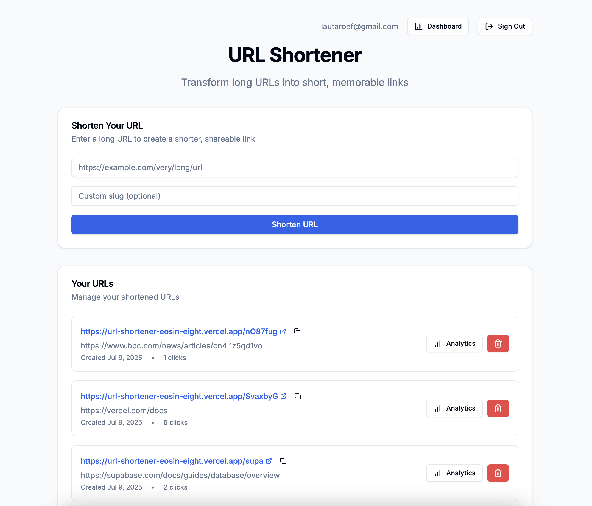
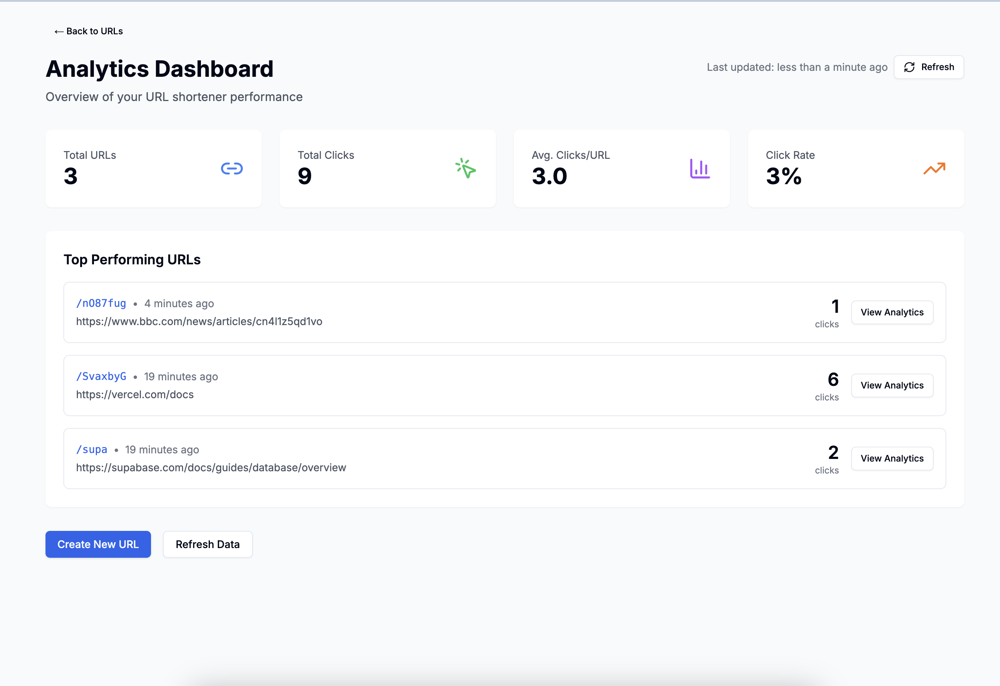

# URL Shortener

A modern URL shortener built with Next.js, NestJS, and Supabase. Transform long URLs into short, memorable links with real-time analytics.



## 🚀 Live Demo

**[https://url-shortener-eosin-eight.vercel.app](https://url-shortener-eosin-eight.vercel.app)**

## ✨ Key Features

- **Instant URL Shortening** - Create short links in milliseconds
- **Custom Slugs** - Choose your own memorable URLs
- **Real-Time Analytics** - Track visits as they happen
- **User Accounts** - Manage all your links in one place
- **Anonymous Usage** - No sign-up required to create links
- **Privacy-First** - No personal data tracking, IPs are hashed
- **Lightning Fast** - Sub-100ms redirects with Redis caching
- **Beautiful UI** - Modern, responsive design with dark mode



## 🛠️ Built With

- **Frontend**: Next.js 14, TypeScript, Tailwind CSS, Recharts
- **Backend**: NestJS, Prisma ORM, JWT Authentication
- **Database**: Supabase (PostgreSQL), Upstash Redis
- **Hosting**: Vercel (Serverless Functions)
- **Auth**: Supabase Authentication

## 📚 Documentation

For a detailed technical overview, see [How It Works](./docs/HOW_IT_WORKS.md).

## 🚀 Getting Started

### Prerequisites

- Node.js 18+
- pnpm 8+
- Supabase account
- Upstash Redis account

### Quick Start

1. **Clone the repository**
   ```bash
   git clone <repository-url>
   cd url-shortener
   ```

2. **Install dependencies**
   ```bash
   pnpm install
   ```

3. **Set up environment variables**

   Create `.env` files in both `apps/frontend` and `apps/backend` directories:

   ```bash
   # apps/backend/.env
   DATABASE_URL="your-supabase-url"
   SUPABASE_URL="your-supabase-url"
   SUPABASE_ANON_KEY="your-anon-key"
   KV_REST_API_URL="your-redis-url"
   KV_REST_API_TOKEN="your-redis-token"
   ```

   ```bash
   # apps/frontend/.env.local
   NEXT_PUBLIC_SUPABASE_URL="your-supabase-url"
   NEXT_PUBLIC_SUPABASE_ANON_KEY="your-anon-key"
   ```

4. **Push database schema**
   ```bash
   cd apps/backend
   npx prisma db push
   ```

5. **Run development servers**
   ```bash
   pnpm dev
   ```

   Visit:
   - Frontend: http://localhost:3000
   - Backend API: http://localhost:3001

## 🏗️ Project Structure

```
url-shortener/
├── apps/
│   ├── frontend/       # Next.js application
│   └── backend/        # NestJS API
├── docs/              # Documentation
└── package.json       # Monorepo configuration
```

## 🔑 Core Features Explained

### High-Performance Architecture
- Redis caching for instant redirects
- Batch processing for analytics data
- Serverless deployment for infinite scale

### Privacy & Security
- SHA256 hashed IP addresses
- JWT authentication
- Rate limiting (30 req/min)
- Input validation on all endpoints

### Developer Experience
- Full TypeScript coverage
- Monorepo with shared configurations
- Hot module replacement
- Comprehensive error handling

## 📈 Performance

- **Redirect Latency**: < 100ms
- **Cache Hit Rate**: > 90%
- **Uptime**: 99.9% (Vercel SLA)
- **Global CDN**: Edge locations worldwide

---

Built with ❤️ to demonstrate modern web development best practices.